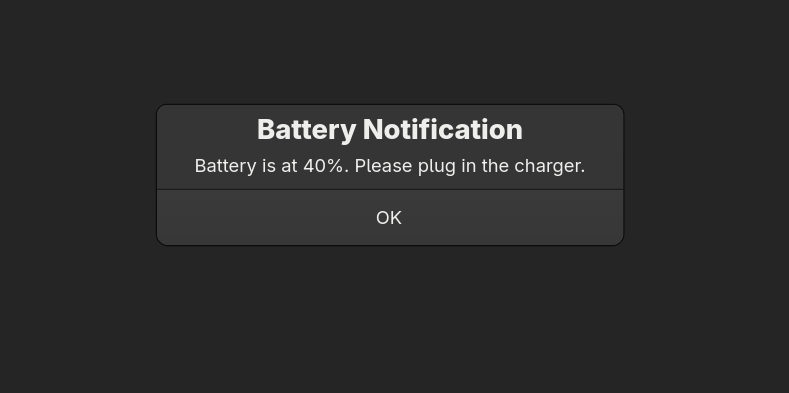
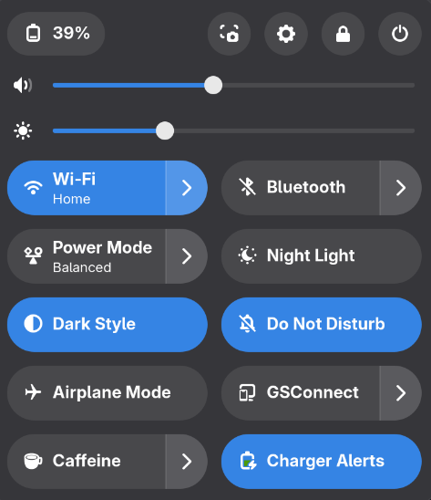

# Charger Alerts ⚡🔋

A lightweight GNOME utility that alerts you when to plug in or unplug your charger based on battery state.

---

## ✨ Features

* Notifies you when battery is too low (plug in charger)
* Notifies you when battery is high (unplug charger)
* Simple GNOME integration via toggle extension
* Runs as a systemd user service

---

## 🚀 Installation

```bash
chmod +x simple-install.sh
./simple-install.sh
```

---

## 📸 Screenshots

Alert in action:



GNOME toggle extension:



---

## 📁 Project Structure

```
.
├── simple-install.sh
├── charger-alerts.js          # Main battery monitoring logic
├── systemd.service/
│   └── charger-alerts.service # systemd user service
├── toggle/                    # GNOME extension toggle
│   ├── extension.js
│   └── metadata.json
└── images/                    # README screenshots
```

---

## ⚙️ How it works

* `charger-alerts.js` periodically checks battery status
* Shows GNOME notifications when thresholds are crossed
* `systemd` service keeps it running in the background
* GNOME extension provides quick enable/disable toggle

---

## 🧠 Requirements

* GNOME Shell
* systemd (user services enabled)
* GJS (GNOME JavaScript runtime)
